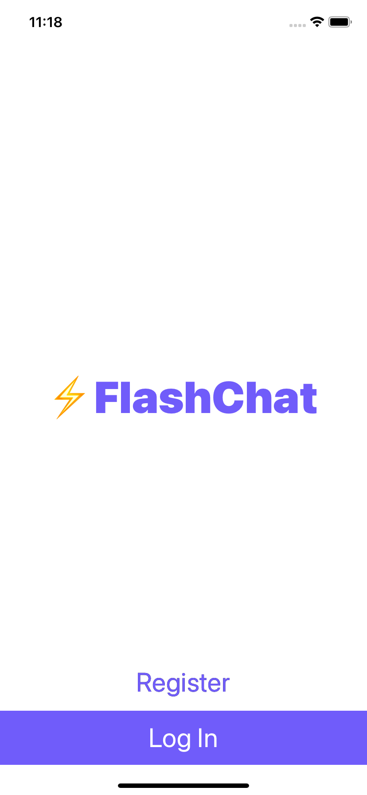
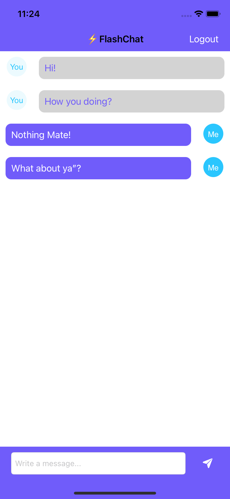

# FlashChat

FlashChat is a real-time chat application developed for iOS, allowing users to communicate instantly in a secure and intuitive environment. With support for both light and dark modes, FlashChat provides a seamless messaging experience across all iOS devices.

## Features
- **Real-Time Messaging:** Send and receive messages instantly with other users.
- **User Authentication:** Secure login and registration using Firebase Authentication.
- **Light and Dark Modes:** Supports both light and dark themes for an optimized user experience.
- **Firebase Integration:** Utilizes Firebase for backend services, including real-time database and authentication.
- **User-Friendly Interface:** Clean and simple UI for easy navigation and use.

## Installation

To install and run FlashChat on your local machine, follow these steps:

### Clone the Repository:
```bash
git clone https://github.com/yourusername/flashchat.git
```

### Open in Xcode:
Open the `FlashChat.xcodeproj` file in Xcode.

### Install Dependencies:
Ensure that you have the latest version of Xcode and Swift installed.
You can manage dependencies using either CocoaPods or Swift Package Manager (SPM).

#### Using CocoaPods:
1. Install CocoaPods if you haven't already:
   ```bash
   sudo gem install cocoapods
   ```
2. Navigate to the project directory and install the required pods:
   ```bash
   pod install
   ```

#### Using Swift Package Manager (SPM):
1. In Xcode, go to `File > Swift Packages > Add Package Dependency`.
2. Enter the URL for the required packages and follow the prompts to add them to your project.

### Run the App:
1. Select your target device or simulator.
2. Click the Run button or press `Cmd + R` to build and run the app.

## Libraries Used
   
FlashChat utilizes the following external libraries to enhance functionality:
- **IQKeyboardManager:** Automatically manages the keyboard's appearance and dismissal, ensuring that text fields are never hidden by the keyboard.
- **CLTypingLabel:** Provides a simple way to create typewriter-style labels, animating text character by character.
- **Firebase/Firestore:** Used for real-time database functionalities, managing chat messages and user data.
- **Firebase/Auth:** Provides user authentication services, including email and password sign-in.

## Usage

### Registering a New User:
1. On the Register Page, enter your email and password to create a new account.
2. Tap Register to complete the registration process.

### Logging In:
1. If you already have an account, go to the Login Page.
2. Enter your email and password, then tap Login.

### Chatting:
1. After logging in, you'll be directed to the Chat Page.
2. Enter your message in the input field and tap Send to communicate with other users in real time.

## Screenshots

### Light Mode

<div style="display: flex; flex-wrap: wrap; gap: 10px; justify-content: space-between;">
    
    
    
    
</div>

### Dark Mode

<div style="display: flex; flex-wrap: wrap; gap: 10px; justify-content: space-between;">
    
    
    
    
</div>

## Contributing

If you'd like to contribute to FlashChat, please fork the repository and use a feature branch. Pull requests are warmly welcome.

1. Fork the repository.
2. Create your feature branch (`git checkout -b feature/AmazingFeature`).
3. Commit your changes (`git commit -m 'Add some AmazingFeature'`).
4. Push to the branch (`git push origin feature/AmazingFeature`).
5. Open a pull request.

## License

This project is licensed under the MIT License - see the [LICENSE](LICENSE) file for details.

## Contact

For any inquiries or feedback, feel free to reach out to Your Name.
